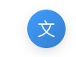
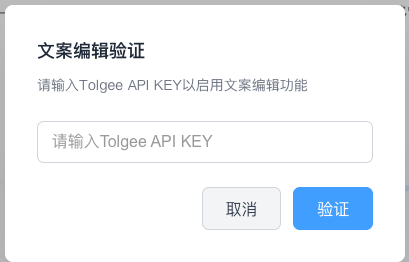
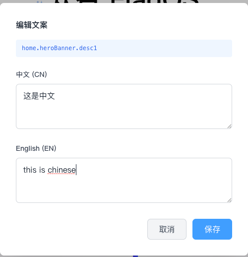

# vite-plugin-tolgee-i18n

**[中文](./README.zh.md)** | **[English](./README.md)**

[](https://www.npmjs.com/package/vite-plugin-tolgee-i18n)
[](https://vuejs.org/)
[](https://vitejs.dev/)
[](LICENSE)

> All-in-one Vue 3 + Tolgee i18n solution — zero-conflict team collaboration, near-zero code intrusion.

> ⚠️ **Vue 3 Only** — This plugin currently supports Vue 3 only (requires `vue >=3.3` and `vue-i18n >=9`). React and Vue 2 support is planned.

## Why Not the Official Tolgee Approach?

Tolgee officially provides a browser extension + SDK integration, but it has notable limitations in real-world projects:

|                       | Official Tolgee                                                                        | vite-plugin-tolgee-i18n                                           |
| --------------------- | -------------------------------------------------------------------------------------- | ----------------------------------------------------------------- |
| **Setup**             | Every team member must install the Chrome extension                                    | No extension needed, works out of the box                         |
| **API intrusion**     | Must replace vue-i18n with `@tolgee/vue`, rewrite all `$t()` calls to `<T>` components | Keeps native `vue-i18n`, `$t()` usage unchanged, zero API changes |
| **Code changes**      | Requires refactoring the entire i18n layer, wrapping the app with Tolgee Provider      | Just register the Vite plugin + one line in `main.ts`             |
| **Production impact** | Tolgee SDK is bundled into production, increasing size                                 | Inspector loads in DEV mode only, zero production impact          |
| **Team onboarding**   | Each member must configure the extension + API Key                                     | Once configured in the project, new members just run `pnpm dev`   |
| **Migration cost**    | Must replace i18n implementation page by page, extremely costly                        | 5-minute setup, no changes to existing translation code           |

### Core Philosophy: Near-Zero Intrusion

This plugin is designed to **not modify any of your existing i18n code**:

- ✅ Keep using native `vue-i18n` API (`$t()`, `useI18n()`, `<i18n-t>`, etc.)
- ✅ Translation files (`zh-CN.ts`, `en.ts`) remain unchanged, no format changes needed
- ✅ Routing, components, and Store i18n logic stay exactly the same
- ✅ Production builds include no extra dependencies
- ✅ Removing the plugin has zero impact on your project, 100% reversible

The only changes are two initialization points:

```ts
// vite.config.ts — add one plugin
tolgeePlugin({ apiUrl, apiKey, locales, syncToCache: true });

// main.ts — enable Inspector in DEV mode (optional)
if (import.meta.env.DEV) {
    setupI18nInspector(app, i18n, { apiUrl, apiKey });
}
```

## What Problems Does It Solve?

In multi-person frontend projects, i18n translation management has these pain points:

### Problems with Traditional i18n Workflows

| Pain Point                     | Symptom                                                                                   | Impact                                                    |
| ------------------------------ | ----------------------------------------------------------------------------------------- | --------------------------------------------------------- |
| **Translation file conflicts** | Multiple people editing `zh-CN.ts` / `en.ts` simultaneously, frequent Git merge conflicts | Wastes time resolving conflicts, translations easily lost |
| **Dev-translation disconnect** | Developers finish code first, then request translations, then manually copy back          | Long process, translations easily missed or outdated      |
| **No WYSIWYG**                 | Editing translations requires manual file editing, saving, waiting for HMR                | Low efficiency, especially unsuitable for non-developers  |
| **Hard to locate keys**        | Seeing text on page but not knowing which i18n key it maps to, requiring global search    | Time waste, especially in large projects with many keys   |
| **Platform disconnection**     | After translations are done on Tolgee/Crowdin, manual export and file replacement needed  | Sync delays, local vs platform inconsistencies            |

### How This Plugin Solves Them

| Solution                        | Implementation                                                                                    |
| ------------------------------- | ------------------------------------------------------------------------------------------------- |
| **Zero-conflict collaboration** | Remote translations written to `.cache/` (gitignored), source files untouched, merged at runtime  |
| **WYSIWYG editing**             | Alt+click text on page → edit directly → instantly push to Tolgee, never leave the browser        |
| **One-click key lookup**        | Alt+hover any text, immediately see the i18n key and translations in all languages                |
| **Real-time sync**              | Automatically pulls latest Tolgee translations on build/dev start, no manual import/export        |
| **Zero-intrusion integration**  | Keeps native vue-i18n, no API changes, no translation file format changes, zero impact on removal |

### Use Cases

- Teams of 3+ collaborating on internationalized projects
- Using Tolgee as the translation management platform
- Existing vue-i18n projects wanting to integrate Tolgee without refactoring the i18n layer
- Product/operations staff needing to directly edit translations
- Fast-iterating projects where translations need to keep pace with development

## Installation

```bash
pnpm add vite-plugin-tolgee-i18n -D
```

Requires: Vue >=3.3, vue-i18n >=9, Vite >=4

## Quick Start

### Register the Plugin

```ts
// vite.config.ts
import { defineConfig } from 'vite';
import { tolgeePlugin } from 'vite-plugin-tolgee-i18n';
import process from 'node:process';

export default defineConfig({
    plugins: [
        tolgeePlugin({
            apiUrl: process.env.TOLGEE_API_URL,
            apiKey: process.env.TOLGEE_API_KEY,
            locales: {
                zh: 'locales/zh-CN.ts',
                en: 'locales/en.ts',
            },
            syncToCache: true,
        }),
    ],
});
```

> `syncToCache: true` writes remote translations to `.cache/` (gitignored), source files are never modified, enabling zero-conflict multi-person collaboration.

### Create the i18n Instance

```ts
// main.ts
import { createApp } from 'vue';
import { createI18nWithTolgee } from 'vite-plugin-tolgee-i18n';
import { setupI18nInspector } from 'vite-plugin-tolgee-i18n/client';
import zhCN from './locales/zh-CN';
import App from './App.vue';

const app = createApp(App);

const i18n = await createI18nWithTolgee(app, {
    apiUrl: import.meta.env.VITE_APP_TOLGEE_API_URL,
    apiKey: import.meta.env.VITE_TOGGLE_SECRET,
    locale: 'zh-CN',
    messages: zhCN,
    enableRuntimeMerge: import.meta.env.DEV,
});

if (import.meta.env.DEV) {
    setupI18nInspector(app, i18n, {
        apiUrl: import.meta.env.VITE_APP_TOLGEE_API_URL,
        apiKey: import.meta.env.VITE_TOGGLE_SECRET,
        theme: 'dark',
        locale: 'zh-CN',
        localeLoader: lang => import(`./locales/${lang}.ts`).then(m => m.default),
    });
}

app.mount('#app');
```

### Switch Locale

```ts
import { switchLocaleWithTolgee } from 'vite-plugin-tolgee-i18n';

async function changeLocale(locale: string) {
    const langModule = await import(`./locales/${locale}.ts`);
    await switchLocaleWithTolgee(i18n, locale, langModule.default, {
        apiUrl: import.meta.env.VITE_APP_TOLGEE_API_URL,
        apiKey: import.meta.env.VITE_TOGGLE_SECRET,
        enableRuntimeMerge: import.meta.env.DEV,
    });
}
```

## Usage Flow

1. Click the "文" button at the bottom-right corner to enter edit mode
   
   
2. Hold **Alt** and hover over text → see the i18n key and translations
   
3. Hold **Alt** and click text → edit dialog pops up, save to push directly to Tolgee
4. Refresh the page, new Tolgee translations take effect immediately

## Architecture Overview

```
┌─────────────────────────────────────────────────────────────┐
│                      Developer Browser                        │
│                                                             │
│  ┌─────────────┐    Alt+Hover     ┌──────────────────────┐  │
│  │  Page Text   │ ───────────────→ │  Inspector Tooltip    │  │
│  │  $t('key')  │                  │  Shows key + langs    │  │
│  └─────────────┘    Alt+Click     └──────────────────────┘  │
│         │          ─────────────→  ┌──────────────────────┐  │
│         │                          │  Edit Dialog          │  │
│         │                          │  Modify → Save        │  │
│         │                          └──────────┬───────────┘  │
│         │                                     │              │
└─────────┼─────────────────────────────────────┼──────────────┘
          │                                     │ Push API
          │ vue-i18n                            ▼
          │                          ┌──────────────────────┐
          │                          │   Tolgee Server      │
          │                          │   (Translation Mgmt)  │
          │                          └──────────┬───────────┘
          │                                     │
          ▼                                     │ Pull (on build/start)
┌─────────────────────────────────────────────────────────────┐
│                      Vite Dev Server                         │
│                                                             │
│  tolgeePlugin:                                              │
│  1. Fetches remote translations on startup                  │
│  2. Writes to .cache/ (gitignored)                          │
│  3. Deep-merges with local translations at runtime          │
│  4. HMR hot-updates translations                            │
└─────────────────────────────────────────────────────────────┘
```

## API Reference

### Vite Plugin

| Param         | Type                     | Required | Default                                           | Description                                                   |
| ------------- | ------------------------ | -------- | ------------------------------------------------- | ------------------------------------------------------------- |
| `apiUrl`      | `string`                 | ✅       | -                                                 | Tolgee API URL                                                |
| `apiKey`      | `string`                 | ✅       | -                                                 | Tolgee API Key                                                |
| `locales`     | `Record<string, string>` | ❌       | `{ zh: 'locales/zh-CN.ts', en: 'locales/en.ts' }` | Locale file path mapping                                      |
| `syncToCache` | `boolean`                | ❌       | `false`                                           | When enabled, syncs Tolgee to `.cache/` and merges at runtime |

### Client API

| Export                                                    | Import Path                      | Description                                  |
| --------------------------------------------------------- | -------------------------------- | -------------------------------------------- |
| `setupI18nInspector(app, i18n, options)`                  | `vite-plugin-tolgee-i18n/client` | Mount the Inspector devtool                  |
| `createI18nWithTolgee(app, options)`                      | `vite-plugin-tolgee-i18n`        | Create i18n instance with Tolgee integration |
| `switchLocaleWithTolgee(i18n, locale, messages, options)` | `vite-plugin-tolgee-i18n`        | Switch locale and merge Tolgee translations  |
| `fetchTolgeeTranslations(apiUrl, apiKey, lang)`           | `vite-plugin-tolgee-i18n`        | Fetch translations from Tolgee               |
| `mergeTranslations(base, overrides)`                      | `vite-plugin-tolgee-i18n`        | Deep-merge translation objects               |

### InspectorSetupOptions

| Param          | Type                                     | Required | Default   | Description             |
| -------------- | ---------------------------------------- | -------- | --------- | ----------------------- |
| `apiUrl`       | `string`                                 | ✅       | -         | Tolgee API URL          |
| `apiKey`       | `string`                                 | ✅       | -         | Tolgee API Key          |
| `theme`        | `'dark' \| 'light'`                      | ❌       | `'dark'`  | Inspector theme         |
| `locale`       | `'zh-CN' \| 'en'`                        | ❌       | `'zh-CN'` | Inspector UI language   |
| `style`        | `InspectorStyleOptions`                  | ❌       | -         | UI style overrides      |
| `localeLoader` | `(lang) => Promise<Record<string, any>>` | ❌       | -         | Locale loading function |

### Type Exports

```ts
import type {
    TolgeePluginOptions,
    InspectorOptions,
    InspectorStyleOptions,
    InspectorTheme,
    InspectorLocale,
    InspectorSetupOptions,
    LocaleLoader,
    CreateI18nOptions,
} from 'vite-plugin-tolgee-i18n';
```

## Environment Variables

```env
VITE_APP_TOLGEE_API_URL=https://tolgee.your-domain.com
VITE_TOGGLE_SECRET=your-project-api-key
```

## Acknowledgments

This plugin is built on top of [Tolgee](https://tolgee.io), an open-source translation management platform. Thanks to the Tolgee team for providing excellent translation infrastructure and open APIs that enable the community to build more flexible integration solutions.

This plugin is not an official Tolgee product. It is a lightweight alternative integration for Vue 3 + vue-i18n projects, designed to lower the barrier to entry and minimize code intrusion. If your project can accept full SDK integration, we recommend using the [official Tolgee Vue integration](https://tolgee.io/integrations/vue).

## License

MIT
